```python
import pandas as pd
import numpy as np
import seaborn as sns
import matplotlib.pyplot as plt
import statsmodels.api as sm
import statsmodels.graphics.regressionplots as smg
from sklearn.preprocessing import StandardScaler, PolynomialFeatures
from sklearn.model_selection import train_test_split
from sklearn.linear_model import LinearRegression
from sklearn.metrics import mean_squared_error, r2_score, mean_absolute_error
```

Provided in tennis_stats.csv is data from the men’s professional tennis league, which is called the ATP [(Association of Tennis Professionals)](https://www.atptour.com/en/). Data from the top 1500 ranked players in the ATP over the span of 2009 to 2017 are provided in file. The statistics recorded for each player in each year include service game (offensive) statistics, return game (defensive) statistics and outcomes.


```python
# Load dataset
tennis = pd.read_csv("tennis_stats.csv")
tennis.head()
```


<div>
<style scoped>
    .dataframe tbody tr th:only-of-type {
        vertical-align: middle;
    }

    .dataframe tbody tr th {
        vertical-align: top;
    }

    .dataframe thead th {
        text-align: right;
    }
</style>
<table border="1" class="dataframe">
  <thead>
    <tr style="text-align: right;">
      <th></th>
      <th>Player</th>
      <th>Year</th>
      <th>FirstServe</th>
      <th>FirstServePointsWon</th>
      <th>FirstServeReturnPointsWon</th>
      <th>SecondServePointsWon</th>
      <th>SecondServeReturnPointsWon</th>
      <th>Aces</th>
      <th>BreakPointsConverted</th>
      <th>BreakPointsFaced</th>
      <th>...</th>
      <th>ReturnGamesWon</th>
      <th>ReturnPointsWon</th>
      <th>ServiceGamesPlayed</th>
      <th>ServiceGamesWon</th>
      <th>TotalPointsWon</th>
      <th>TotalServicePointsWon</th>
      <th>Wins</th>
      <th>Losses</th>
      <th>Winnings</th>
      <th>Ranking</th>
    </tr>
  </thead>
  <tbody>
    <tr>
      <th>0</th>
      <td>Pedro Sousa</td>
      <td>2016</td>
      <td>0.88</td>
      <td>0.50</td>
      <td>0.38</td>
      <td>0.50</td>
      <td>0.39</td>
      <td>0</td>
      <td>0.14</td>
      <td>7</td>
      <td>...</td>
      <td>0.11</td>
      <td>0.38</td>
      <td>8</td>
      <td>0.50</td>
      <td>0.43</td>
      <td>0.50</td>
      <td>1</td>
      <td>2</td>
      <td>39820</td>
      <td>119</td>
    </tr>
    <tr>
      <th>1</th>
      <td>Roman Safiullin</td>
      <td>2017</td>
      <td>0.84</td>
      <td>0.62</td>
      <td>0.26</td>
      <td>0.33</td>
      <td>0.07</td>
      <td>7</td>
      <td>0.00</td>
      <td>7</td>
      <td>...</td>
      <td>0.00</td>
      <td>0.20</td>
      <td>9</td>
      <td>0.67</td>
      <td>0.41</td>
      <td>0.57</td>
      <td>0</td>
      <td>1</td>
      <td>17334</td>
      <td>381</td>
    </tr>
    <tr>
      <th>2</th>
      <td>Pedro Sousa</td>
      <td>2017</td>
      <td>0.83</td>
      <td>0.60</td>
      <td>0.28</td>
      <td>0.53</td>
      <td>0.44</td>
      <td>2</td>
      <td>0.38</td>
      <td>10</td>
      <td>...</td>
      <td>0.16</td>
      <td>0.34</td>
      <td>17</td>
      <td>0.65</td>
      <td>0.45</td>
      <td>0.59</td>
      <td>4</td>
      <td>1</td>
      <td>109827</td>
      <td>119</td>
    </tr>
    <tr>
      <th>3</th>
      <td>Rogerio Dutra Silva</td>
      <td>2010</td>
      <td>0.83</td>
      <td>0.64</td>
      <td>0.34</td>
      <td>0.59</td>
      <td>0.33</td>
      <td>2</td>
      <td>0.33</td>
      <td>5</td>
      <td>...</td>
      <td>0.14</td>
      <td>0.34</td>
      <td>15</td>
      <td>0.80</td>
      <td>0.49</td>
      <td>0.63</td>
      <td>0</td>
      <td>0</td>
      <td>9761</td>
      <td>125</td>
    </tr>
    <tr>
      <th>4</th>
      <td>Daniel Gimeno-Traver</td>
      <td>2017</td>
      <td>0.81</td>
      <td>0.54</td>
      <td>0.00</td>
      <td>0.33</td>
      <td>0.33</td>
      <td>1</td>
      <td>0.00</td>
      <td>2</td>
      <td>...</td>
      <td>0.00</td>
      <td>0.20</td>
      <td>2</td>
      <td>0.50</td>
      <td>0.35</td>
      <td>0.50</td>
      <td>0</td>
      <td>1</td>
      <td>32879</td>
      <td>272</td>
    </tr>
  </tbody>
</table>
<p>5 rows × 24 columns</p>
</div>


```python
# examine dtypes and shape of dataframe
tennis.info()
```

    <class 'pandas.core.frame.DataFrame'>
    RangeIndex: 1721 entries, 0 to 1720
    Data columns (total 24 columns):
     #   Column                      Non-Null Count  Dtype  
    ---  ------                      --------------  -----  
     0   Player                      1721 non-null   object 
     1   Year                        1721 non-null   int64  
     2   FirstServe                  1721 non-null   float64
     3   FirstServePointsWon         1721 non-null   float64
     4   FirstServeReturnPointsWon   1721 non-null   float64
     5   SecondServePointsWon        1721 non-null   float64
     6   SecondServeReturnPointsWon  1721 non-null   float64
     7   Aces                        1721 non-null   int64  
     8   BreakPointsConverted        1721 non-null   float64
     9   BreakPointsFaced            1721 non-null   int64  
     10  BreakPointsOpportunities    1721 non-null   int64  
     11  BreakPointsSaved            1721 non-null   float64
     12  DoubleFaults                1721 non-null   int64  
     13  ReturnGamesPlayed           1721 non-null   int64  
     14  ReturnGamesWon              1721 non-null   float64
     15  ReturnPointsWon             1721 non-null   float64
     16  ServiceGamesPlayed          1721 non-null   int64  
     17  ServiceGamesWon             1721 non-null   float64
     18  TotalPointsWon              1721 non-null   float64
     19  TotalServicePointsWon       1721 non-null   float64
     20  Wins                        1721 non-null   int64  
     21  Losses                      1721 non-null   int64  
     22  Winnings                    1721 non-null   int64  
     23  Ranking                     1721 non-null   int64  
    dtypes: float64(12), int64(11), object(1)
    memory usage: 322.8+ KB
    


```python
# examine NA's
tennis.isna().sum()
```


    Player                        0
    Year                          0
    FirstServe                    0
    FirstServePointsWon           0
    FirstServeReturnPointsWon     0
    SecondServePointsWon          0
    SecondServeReturnPointsWon    0
    Aces                          0
    BreakPointsConverted          0
    BreakPointsFaced              0
    BreakPointsOpportunities      0
    BreakPointsSaved              0
    DoubleFaults                  0
    ReturnGamesPlayed             0
    ReturnGamesWon                0
    ReturnPointsWon               0
    ServiceGamesPlayed            0
    ServiceGamesWon               0
    TotalPointsWon                0
    TotalServicePointsWon         0
    Wins                          0
    Losses                        0
    Winnings                      0
    Ranking                       0
    dtype: int64


```python
# Drop Player and Year Columns
tennis_clean = tennis.drop(["Player", "Year"], axis=1)
tennis_clean.head()
```


<div>
<style scoped>
    .dataframe tbody tr th:only-of-type {
        vertical-align: middle;
    }

    .dataframe tbody tr th {
        vertical-align: top;
    }

    .dataframe thead th {
        text-align: right;
    }
</style>
<table border="1" class="dataframe">
  <thead>
    <tr style="text-align: right;">
      <th></th>
      <th>FirstServe</th>
      <th>FirstServePointsWon</th>
      <th>FirstServeReturnPointsWon</th>
      <th>SecondServePointsWon</th>
      <th>SecondServeReturnPointsWon</th>
      <th>Aces</th>
      <th>BreakPointsConverted</th>
      <th>BreakPointsFaced</th>
      <th>BreakPointsOpportunities</th>
      <th>BreakPointsSaved</th>
      <th>...</th>
      <th>ReturnGamesWon</th>
      <th>ReturnPointsWon</th>
      <th>ServiceGamesPlayed</th>
      <th>ServiceGamesWon</th>
      <th>TotalPointsWon</th>
      <th>TotalServicePointsWon</th>
      <th>Wins</th>
      <th>Losses</th>
      <th>Winnings</th>
      <th>Ranking</th>
    </tr>
  </thead>
  <tbody>
    <tr>
      <th>0</th>
      <td>0.88</td>
      <td>0.50</td>
      <td>0.38</td>
      <td>0.50</td>
      <td>0.39</td>
      <td>0</td>
      <td>0.14</td>
      <td>7</td>
      <td>7</td>
      <td>0.43</td>
      <td>...</td>
      <td>0.11</td>
      <td>0.38</td>
      <td>8</td>
      <td>0.50</td>
      <td>0.43</td>
      <td>0.50</td>
      <td>1</td>
      <td>2</td>
      <td>39820</td>
      <td>119</td>
    </tr>
    <tr>
      <th>1</th>
      <td>0.84</td>
      <td>0.62</td>
      <td>0.26</td>
      <td>0.33</td>
      <td>0.07</td>
      <td>7</td>
      <td>0.00</td>
      <td>7</td>
      <td>0</td>
      <td>0.57</td>
      <td>...</td>
      <td>0.00</td>
      <td>0.20</td>
      <td>9</td>
      <td>0.67</td>
      <td>0.41</td>
      <td>0.57</td>
      <td>0</td>
      <td>1</td>
      <td>17334</td>
      <td>381</td>
    </tr>
    <tr>
      <th>2</th>
      <td>0.83</td>
      <td>0.60</td>
      <td>0.28</td>
      <td>0.53</td>
      <td>0.44</td>
      <td>2</td>
      <td>0.38</td>
      <td>10</td>
      <td>8</td>
      <td>0.40</td>
      <td>...</td>
      <td>0.16</td>
      <td>0.34</td>
      <td>17</td>
      <td>0.65</td>
      <td>0.45</td>
      <td>0.59</td>
      <td>4</td>
      <td>1</td>
      <td>109827</td>
      <td>119</td>
    </tr>
    <tr>
      <th>3</th>
      <td>0.83</td>
      <td>0.64</td>
      <td>0.34</td>
      <td>0.59</td>
      <td>0.33</td>
      <td>2</td>
      <td>0.33</td>
      <td>5</td>
      <td>6</td>
      <td>0.40</td>
      <td>...</td>
      <td>0.14</td>
      <td>0.34</td>
      <td>15</td>
      <td>0.80</td>
      <td>0.49</td>
      <td>0.63</td>
      <td>0</td>
      <td>0</td>
      <td>9761</td>
      <td>125</td>
    </tr>
    <tr>
      <th>4</th>
      <td>0.81</td>
      <td>0.54</td>
      <td>0.00</td>
      <td>0.33</td>
      <td>0.33</td>
      <td>1</td>
      <td>0.00</td>
      <td>2</td>
      <td>0</td>
      <td>0.50</td>
      <td>...</td>
      <td>0.00</td>
      <td>0.20</td>
      <td>2</td>
      <td>0.50</td>
      <td>0.35</td>
      <td>0.50</td>
      <td>0</td>
      <td>1</td>
      <td>32879</td>
      <td>272</td>
    </tr>
  </tbody>
</table>
<p>5 rows × 22 columns</p>
</div>


```python
# Create a correlation matrix
corr_matrix = tennis_clean.corr()

# Plot the correlation matrix as heatmap

fig, ax = plt.subplots(figsize=(15,15))
ax = sns.heatmap(corr_matrix, annot=True, cmap='coolwarm', annot_kws={"size":6})
plt.title("Correlation Matrix of all Features")
plt.show()
plt.close()

```


    
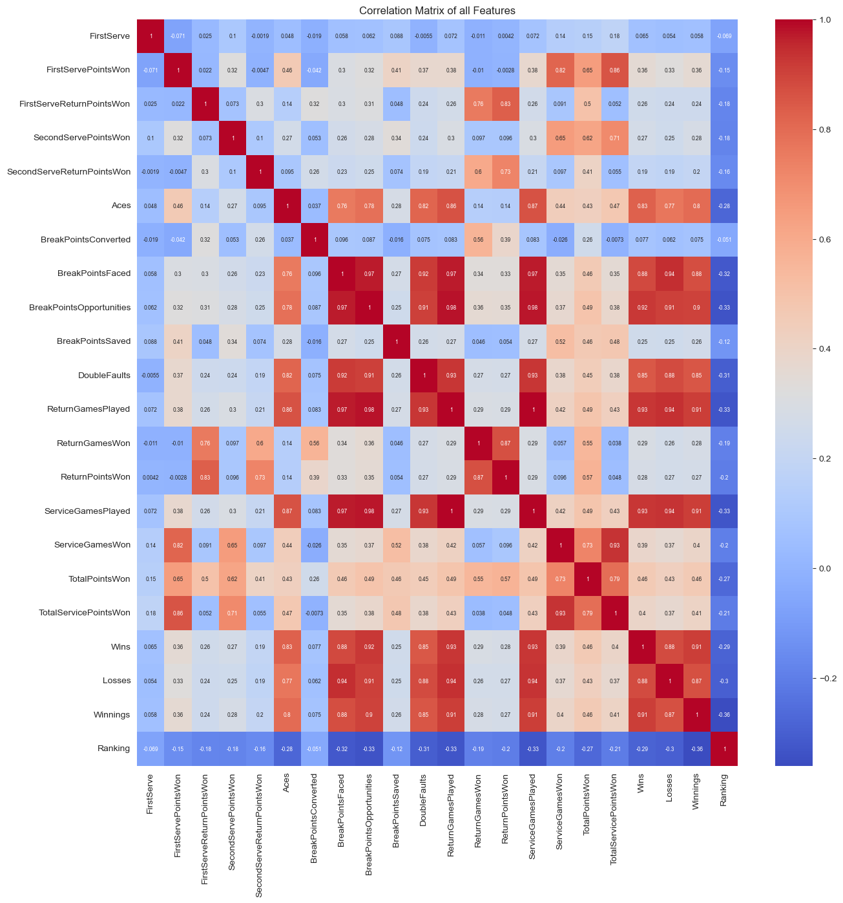
    


```python


# Create "Heatmap on Target"-Function

def heatmap_on_target(data, target):
    f, ax = plt.subplots(figsize=(8,12))
    ax = sns.heatmap(data[[target]].sort_values(by=target, ascending=False), vmin=-1, vmax=1, annot=True, cmap="BrBG")
    plt.show()
    plt.close()

heatmap_on_target(corr_matrix, "Wins")
```


    
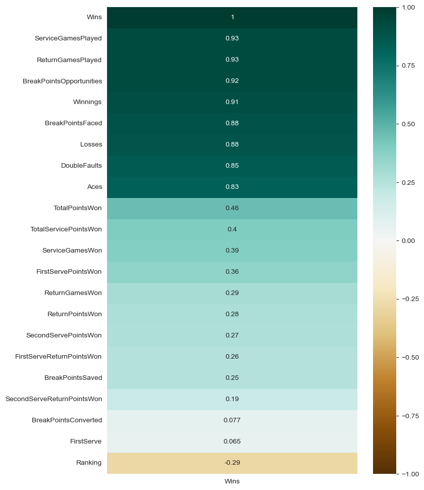
    


```python
heatmap_on_target(corr_matrix, "Winnings")
```


    
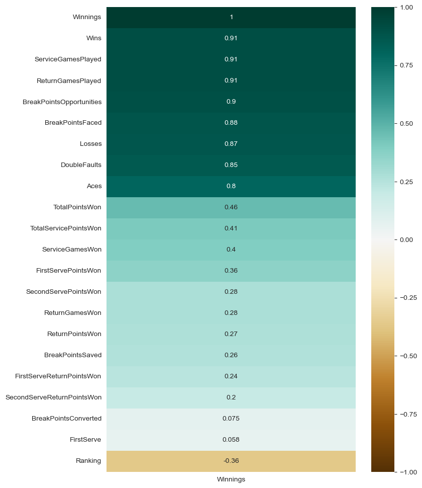
    


```python
heatmap_on_target(corr_matrix, "Losses")
```


    
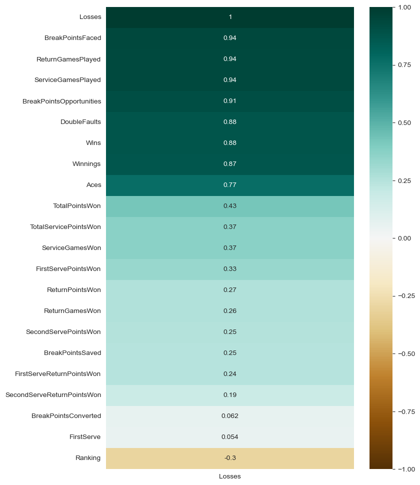
    


```python
heatmap_on_target(corr_matrix, "Ranking")
```


    
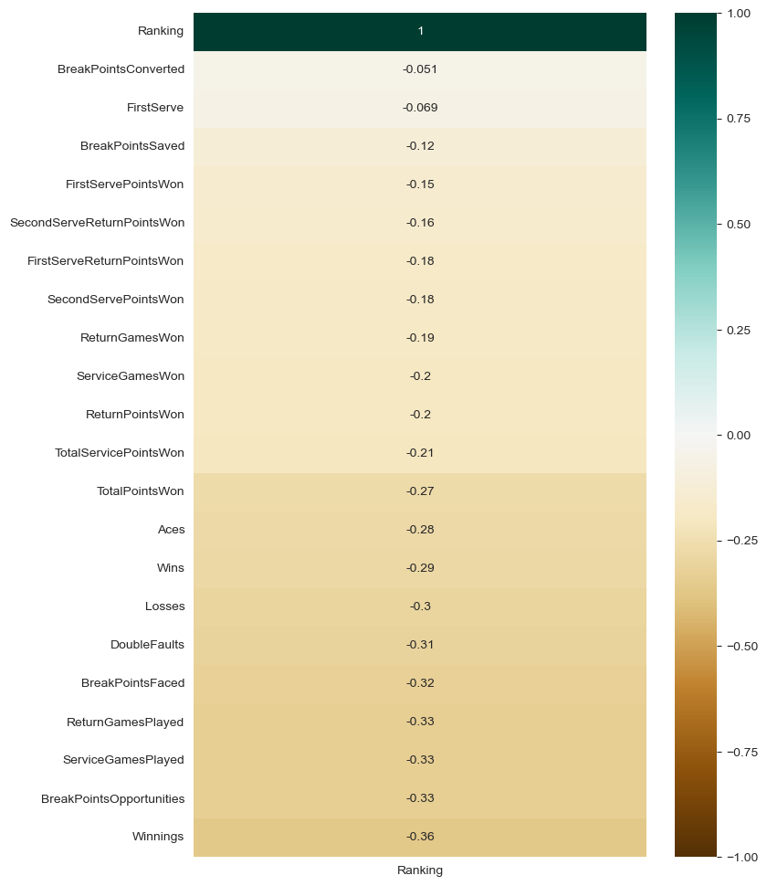
    


```python
# flat x and y
x = tennis_clean.BreakPointsOpportunities
y = tennis_clean.Wins


sns.scatterplot(x=x, y=y)
plt.show()
plt.close()
```


    
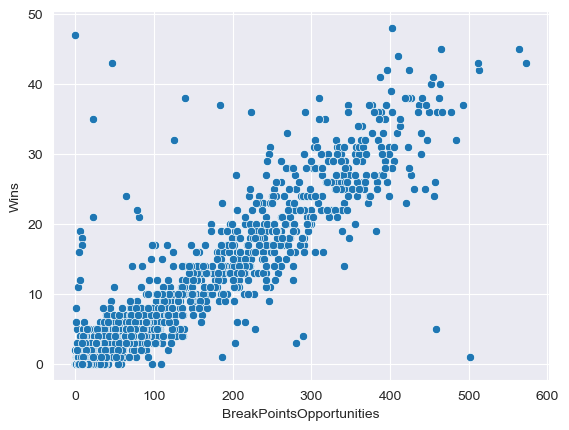
    


```python
# Linear Regression with statsmodels

# Adding intercept b0
x = sm.add_constant(x)

# Create model
model = sm.OLS(y,x)

# Applying .fit()
results = model.fit()

# Getting results
print(results.summary())


```

                                OLS Regression Results                            
    ==============================================================================
    Dep. Variable:                   Wins   R-squared:                       0.853
    Model:                            OLS   Adj. R-squared:                  0.853
    Method:                 Least Squares   F-statistic:                     9956.
    Date:                Sat, 15 Apr 2023   Prob (F-statistic):               0.00
    Time:                        22:02:54   Log-Likelihood:                -4787.1
    No. Observations:                1721   AIC:                             9578.
    Df Residuals:                    1719   BIC:                             9589.
    Df Model:                           1                                         
    Covariance Type:            nonrobust                                         
    ============================================================================================
                                   coef    std err          t      P>|t|      [0.025      0.975]
    --------------------------------------------------------------------------------------------
    const                       -0.0072      0.123     -0.059      0.953      -0.248       0.234
    BreakPointsOpportunities     0.0766      0.001     99.781      0.000       0.075       0.078
    ==============================================================================
    Omnibus:                     1089.596   Durbin-Watson:                   1.999
    Prob(Omnibus):                  0.000   Jarque-Bera (JB):            78905.545
    Skew:                           2.179   Prob(JB):                         0.00
    Kurtosis:                      35.884   Cond. No.                         209.
    ==============================================================================
    
    Notes:
    [1] Standard Errors assume that the covariance matrix of the errors is correctly specified.
    

**Dependent variable vs. Exogenous variable plot:** This plot shows the relationship between the dependent variable (y) and the exogenous variable (x) on a scatterplot. It allows you to visually assess the direction and strength of the relationship between the two variables. In this case, we can see that there is a positive relationship between education and prestige, meaning that as education increases, so does prestige.

**Partial regression plot:** This plot shows the relationship between the dependent variable (y) and the exogenous variable (x), with the effect of other exogenous variables held constant (assuming there are other exogenous variables in the model). It allows you to visualize the strength and direction of the relationship between the two variables, while controlling for other variables. In this case, we can see that the positive relationship between education and prestige remains when other variables are held constant.

**Residuals versus education plot:** This plot shows the relationship between the residuals (the difference between the actual and predicted values of y) and the exogenous variable (x) on a scatterplot. It allows you to assess whether there is a pattern in the residuals that suggests a violation of the assumptions of linear regression (e.g., nonlinearity, heteroscedasticity). In this case, we can see that the residuals are randomly scattered around zero, indicating that the assumption of linearity is met.

**Normal Q-Q plot of residuals:** This plot shows the distribution of the residuals compared to a normal distribution. It allows you to assess whether the residuals are normally distributed, which is an assumption of linear regression. In this case, we can see that the residuals follow a relatively straight line, indicating that they are normally distributed.


```python
fig = sm.graphics.plot_regress_exog(results, "BreakPointsOpportunities")
fig.tight_layout(pad=1.0)
```

    eval_env: 1
    


    
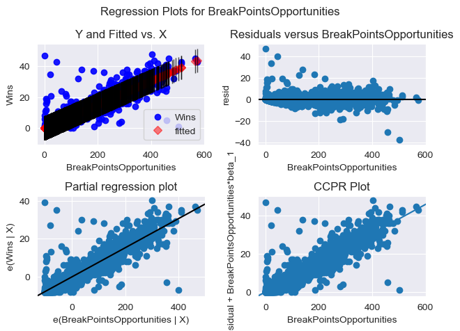
    


**Influence Plot:**: The Influence Plot is a useful tool for identifying data points that may have a large impact on the model, such as having high leverage or deviating significantly from the other data points. Points that are in the upper-right and lower-right quadrants have both high leverage and high deviation from the other data points, and can have the greatest impact on the model.

The Influence Plot also includes information on the Cook's D statistic, which is a measure of a data point's influence on the regression estimates. Data points with high Cook's D values may have a significant impact on the model and should be examined more closely.

In summary, Influence Plots can help identify potential issues with data points and aid in deciding whether they should be removed from the model. However, it is important not to make these decisions based solely on the Influence Plot, but to also consider other information such as knowledge of the context of the data or the plausibility of the data points.


```python
#plot linear regression
fig, ax = plt.subplots(figsize=(8,6))
smg.influence_plot(results, ax=ax)
plt.show()
plt.close()
```


    
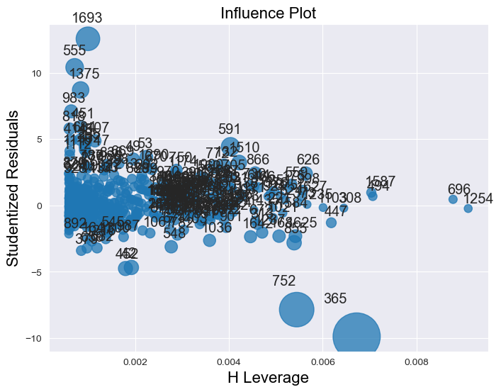
    


```python
x = tennis_clean.ServiceGamesPlayed
y = tennis_clean.Ranking

sns.scatterplot(x=x, y=y)
plt.show()
plt.close()
```


    
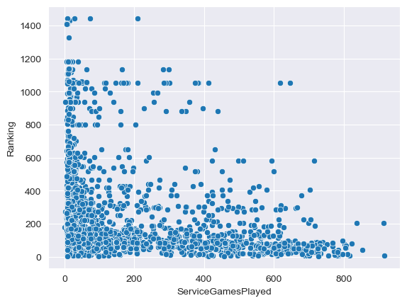
    


```python
# Linear Regression with statsmodel

# Adding intercept b0
x = sm.add_constant(x)

#Create model
model = sm.OLS(y,x)
results = model.fit()

# Getting results
print(results.summary())


```

                                OLS Regression Results                            
    ==============================================================================
    Dep. Variable:                Ranking   R-squared:                       0.110
    Model:                            OLS   Adj. R-squared:                  0.110
    Method:                 Least Squares   F-statistic:                     212.6
    Date:                Sat, 15 Apr 2023   Prob (F-statistic):           1.74e-45
    Time:                        22:02:57   Log-Likelihood:                -12022.
    No. Observations:                1721   AIC:                         2.405e+04
    Df Residuals:                    1719   BIC:                         2.406e+04
    Df Model:                           1                                         
    Covariance Type:            nonrobust                                         
    ======================================================================================
                             coef    std err          t      P>|t|      [0.025      0.975]
    --------------------------------------------------------------------------------------
    const                351.8171      8.461     41.581      0.000     335.222     368.412
    ServiceGamesPlayed    -0.4159      0.029    -14.580      0.000      -0.472      -0.360
    ==============================================================================
    Omnibus:                      575.398   Durbin-Watson:                   1.853
    Prob(Omnibus):                  0.000   Jarque-Bera (JB):             1581.893
    Skew:                           1.769   Prob(JB):                         0.00
    Kurtosis:                       6.089   Cond. No.                         398.
    ==============================================================================
    
    Notes:
    [1] Standard Errors assume that the covariance matrix of the errors is correctly specified.
    


```python
fig = sm.graphics.plot_regress_exog(results, "ServiceGamesPlayed")
fig.tight_layout(pad=1.0)
```

    eval_env: 1
    


    
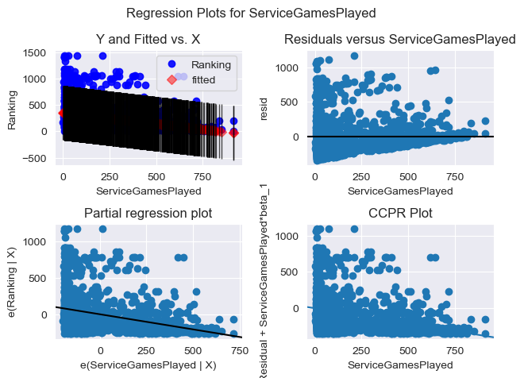
    


```python
#plot linear regression
fig, ax = plt.subplots(figsize=(8,6))
smg.influence_plot(results, ax=ax)
plt.show()
plt.close()
```


    
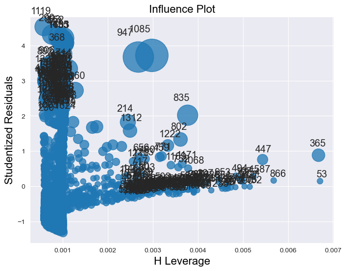
    


```python
# prepare data
X = tennis_clean.drop(columns=["Wins", "Winnings", "Ranking", "Losses"], axis=1, inplace=False)

Y_wins = tennis_clean.Wins.values
Y_winnings = tennis_clean.Winnings.values
Y_ranking = tennis_clean.Ranking.values
Y_losses = tennis_clean.Losses.values

#Z-Transformation
X = StandardScaler().fit_transform(X)

# Split data into training and test sets
X_train_wins, X_test_wins, Y_train_wins, Y_test_wins = train_test_split(X, Y_wins, test_size=0.2, random_state=42)

X_train_winnings, X_test_winnings, Y_train_winnings, Y_test_winnings = train_test_split(X, Y_winnings, test_size=0.2, random_state=42)

X_train_ranking, X_test_ranking, Y_train_ranking, Y_test_ranking = train_test_split(X, Y_ranking, test_size=0.2, random_state=42)

X_train_losses, X_test_losses, Y_train_losses, Y_test_losses = train_test_split(X, Y_losses, test_size=0.2, random_state=42)


```


```python
# Creating a Regression Model
mlr = LinearRegression()

# Fitting the Model
mlr.fit(X_train_winnings, Y_train_winnings)

# Making Predictions
y_predict_winnings = mlr.predict(X_test_winnings)

# Model Evaluation
print("Mean Squarred Error: ", mean_squared_error(Y_test_winnings, y_predict_winnings))
print("Mean Absolute Error: ", mean_absolute_error(Y_test_winnings, y_predict_winnings))
print("R2: ", r2_score(Y_test_winnings, y_predict_winnings))


```

    Mean Squarred Error:  10239044220.288792
    Mean Absolute Error:  57342.87647708136
    R2:  0.8268140857573166
    

### Model Evaluation of Winnings
**Mean Squared Error (MSE):**
The MSE measures the average squared difference between the predicted values and the true values. It is calculated by taking the sum of the squared differences between the predicted and true values, and then dividing by the number of samples.

A higher MSE value indicates that the model is not accurately predicting the outcome. In our case, the MSE value is quite high at 10239044220.288792, which suggests that the model is not making very accurate predictions.

Mean Absolute Error (MAE):
The MAE measures the average absolute difference between the predicted values and the true values. It is calculated by taking the sum of the absolute differences between the predicted and true values, and then dividing by the number of samples.

A lower MAE value indicates that the model is making more accurate predictions. In our case, the MAE value is 57342.87647708136, which is not very low, but it's not extremely high either.

R-squared (R2) score:
The R2 score measures the proportion of variance in the target variable that is explained by the model. It ranges from 0 to 1, with 1 indicating a perfect fit and 0 indicating that the model is no better than predicting the mean value of the target variable.

A higher R2 score indicates a better fit of the model to the data. In our case, the R2 score is 0.8268140857573166, which suggests that the model is explaining about 82% of the variance in the target variable.

Overall, these metrics can help you evaluate the performance of your model, and identify areas where the model may be improved. However, it's important to keep in mind that no single metric can provide a complete picture of the model's performance, so it's often a good idea to use a combination of metrics to get a more comprehensive understanding of the model's strengths and weaknesses.


```python
#Residual Plot
residuals = Y_test_winnings - y_predict_winnings
plt.scatter(y_predict_winnings, residuals, alpha=0.4)
plt.title('Residual Plot of Wins')
plt.xlabel('Predicted values')
plt.ylabel('Residuals')
plt.show()
plt.close()
```


    

    


The big cluster of points at the x=0, y=0 axis in our scatter plot suggests that the regression model is not able to capture the underlying relationship between the predictor and response variables for those data points. The residuals for these points are likely to be large, indicating that the model is not fitting them well. **Accordingly, our MSE value of 10239044220.288792 is very high, which supports the assumption that our model makes inaccurate predictions**

One possible reason for this could be that the model is not flexible enough to capture the nonlinear relationship between the predictor and response variables for these data points. In this case, we could try using a more flexible model, such as a polynomial regression or a nonlinear regression model.

Alternatively, it's possible that there are other variables that are important for predicting the response variable, but are not included in the current model. If this is the case, we may need to gather additional data or revise our model to include these variables.


```python
def scatter(x, y):
    sns.scatterplot(x=x, y=y)
    plt.show()
    plt.close()
```


```python
# defining the target variabel
y = "Winnings"

# Selecting only numerical columns
tennis_numeric = tennis_clean.select_dtypes(include=[np.number])


for x in tennis_clean:
    if x != y:
        scatter(getattr(tennis_numeric, x), getattr(tennis_numeric, y))
```


    
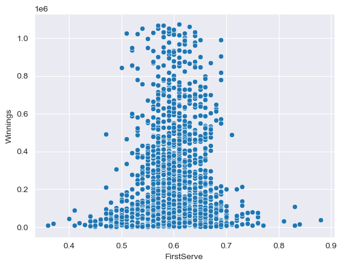
    


    
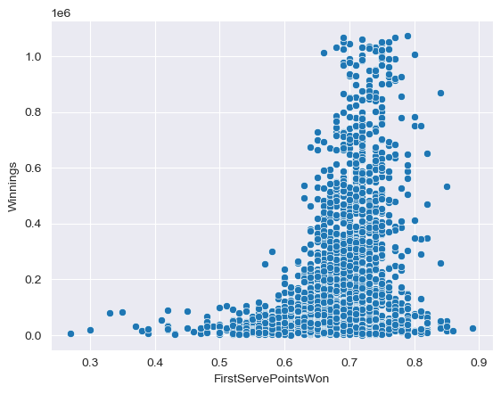
    


    
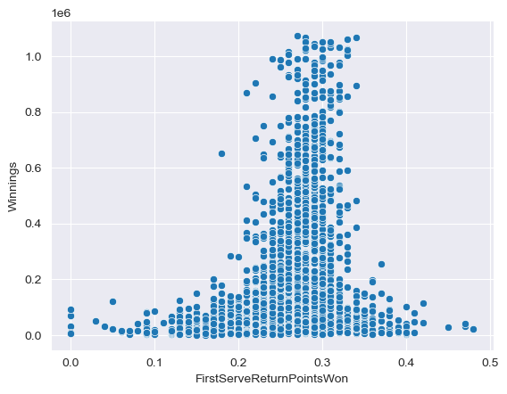
    


    
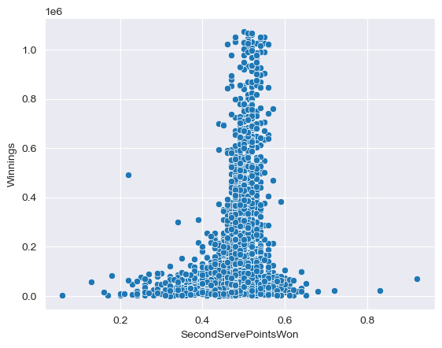
    


    
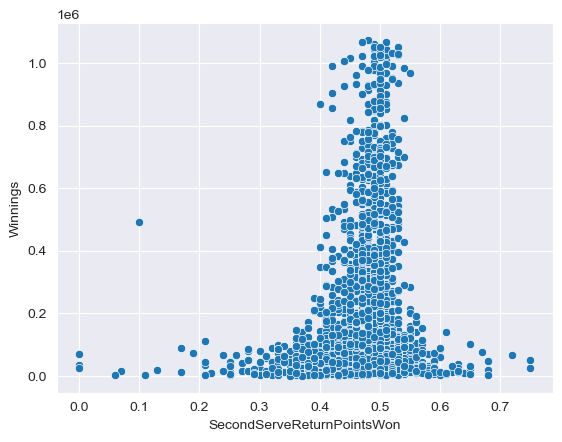
    


    
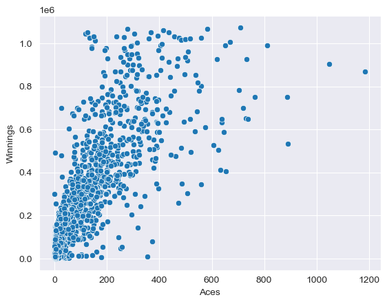
    


    
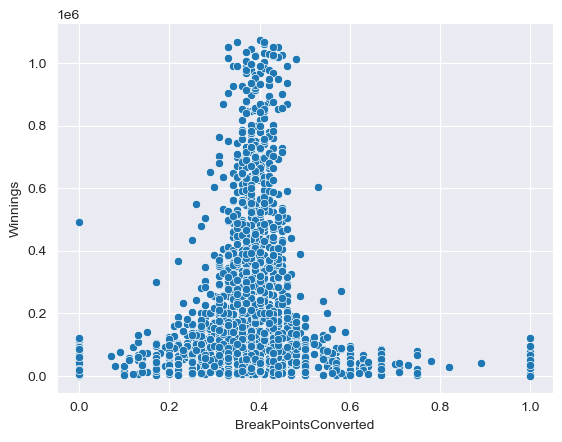
    


    
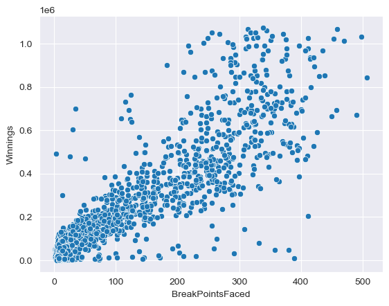
    


    
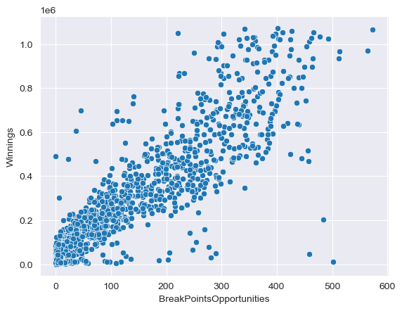
    


    
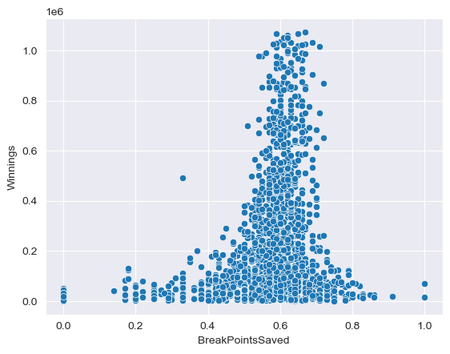
    


    
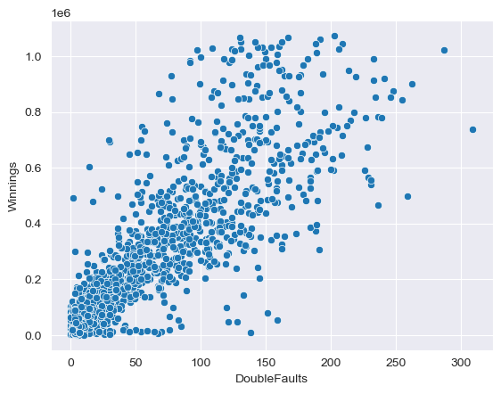
    


    
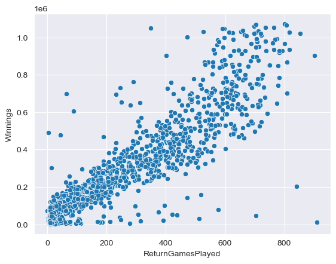
    


    
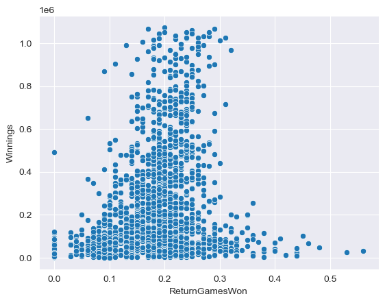
    


    
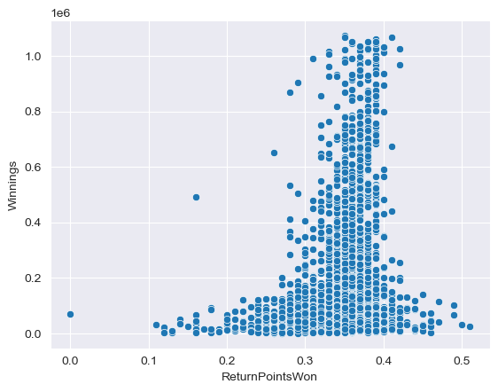
    


    
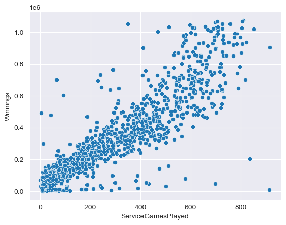
    


    
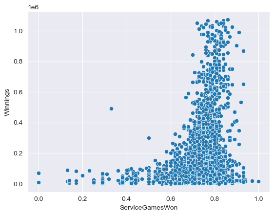
    


    
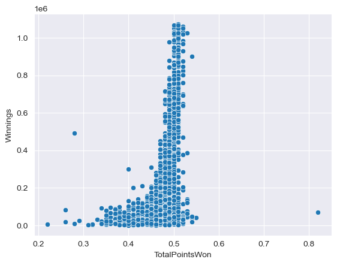
    


    
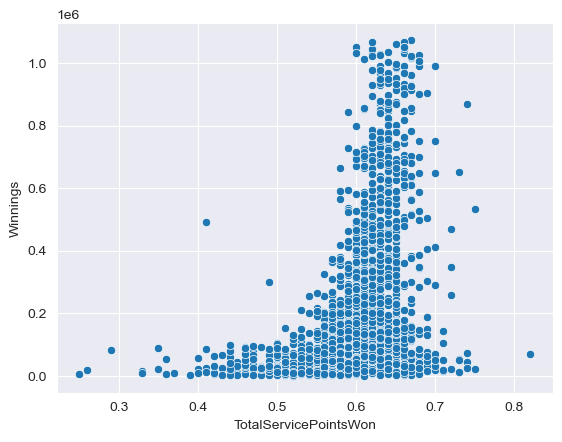
    


    
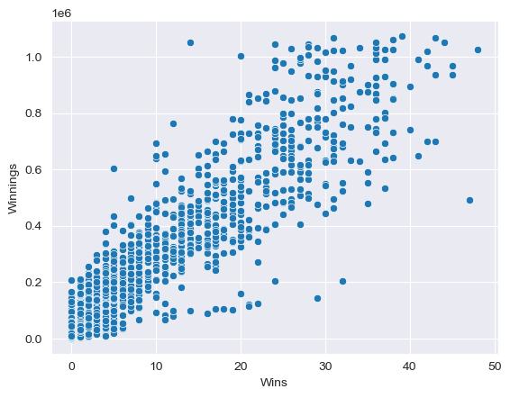
    


    
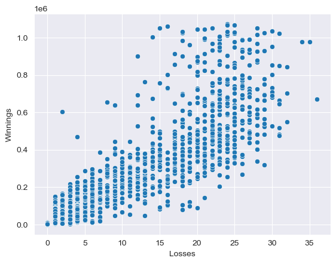
    


    
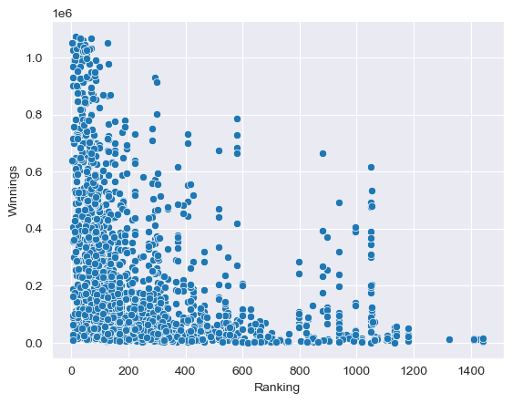
    


### Reduce Features

Some of the features appear to be non-linear


```python
# prepare data
X = tennis_clean.drop(columns=["Wins", "Winnings", "Ranking", "Losses", "TotalServicePointsWon", "TotalPointsWon", "ServiceGamesWon", "Aces", "ReturnGamesWon", "BreakPointsConverted", "BreakPointsSaved", "SecondServePointsWon", "SecondServeReturnPointsWon", "FirstServe"], axis=1, inplace=False)

Y_wins = tennis_clean.Wins.values
Y_winnings = tennis_clean.Winnings.values
Y_ranking = tennis_clean.Ranking.values
Y_losses = tennis_clean.Losses.values

#Z-Transformation
X = StandardScaler().fit_transform(X)

# Split data into training and test sets
X_train_wins, X_test_wins, Y_train_wins, Y_test_wins = train_test_split(X, Y_wins, test_size=0.2, random_state=42)

X_train_winnings, X_test_winnings, Y_train_winnings, Y_test_winnings = train_test_split(X, Y_winnings, test_size=0.2, random_state=42)

X_train_ranking, X_test_ranking, Y_train_ranking, Y_test_ranking = train_test_split(X, Y_ranking, test_size=0.2, random_state=42)

X_train_losses, X_test_losses, Y_train_losses, Y_test_losses = train_test_split(X, Y_losses, test_size=0.2, random_state=42)
```


```python
# Creating a Regression Model
mlr = LinearRegression()

# Fitting the Model
mlr.fit(X_train_winnings, Y_train_winnings)

# Making Predictions
y_predict_winnings = mlr.predict(X_test_winnings)

# Model Evaluation
print("Mean Squarred Error: ", mean_squared_error(Y_test_winnings, y_predict_winnings))
print("Mean Absolute Error: ", mean_absolute_error(Y_test_winnings, y_predict_winnings))
print("R2: ", r2_score(Y_test_winnings, y_predict_winnings))
```

    Mean Squarred Error:  10033449282.476423
    Mean Absolute Error:  57433.95793956312
    R2:  0.8302915731577665
    


```python
#Residual Plot
residuals = Y_test_winnings - y_predict_winnings
plt.scatter(y_predict_winnings, residuals, alpha=0.4)
plt.title('Residual Plot of Wins')
plt.xlabel('Predicted values')
plt.ylabel('Residuals')
plt.show()
plt.close()
```


    
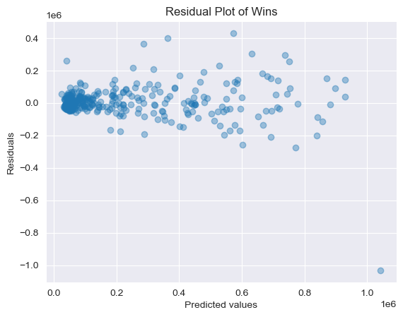
    


### Conclusion
The first set of values has a higher MSE (10,239,044,220.288792) and a slightly lower R2 value (0.8268140857573166), indicating that the model has a larger average squared deviation between actual and predicted values and explains less of the overall variation in the data. The MAE value is similar to the second set of values (57,342.87647708136).

The second set of values has a lower MSE (10,033,449,282.476423) and a slightly higher R2 value (0.8302915731577665), indicating that the model is better fitted to the data, has a lower average squared deviation, and explains more of the overall variation in the data. The MAE value is also similar to the first set of values (57,433.95793956312).

Overall, the second set of values seems to provide slightly better prediction results than the first set of values, but it is important to consider the specific requirements and use cases to make a final decision.
